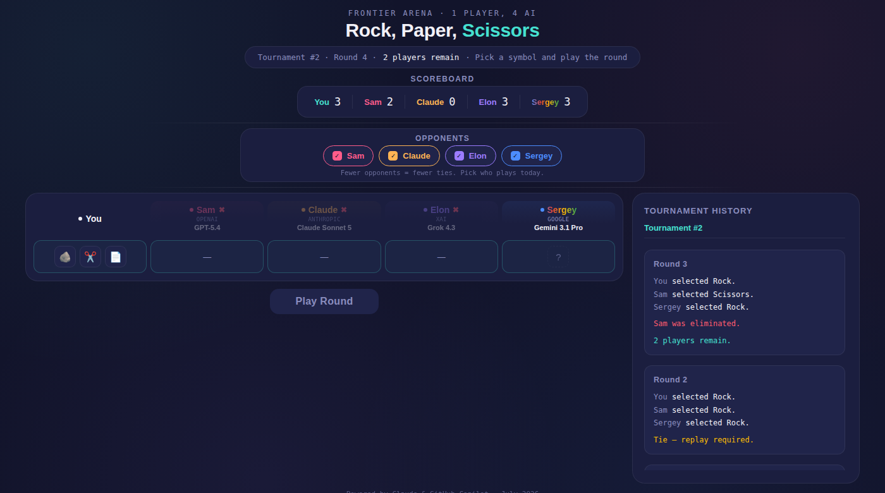

# Rock, Paper, Scissors — Frontier Arena

A tournament arena where you play Rock/Paper/Scissors against four real frontier LLMs — GPT-5.4, Claude Sonnet 5, Grok 4.3, and Gemini 3.1 Pro — each with full memory of everything that's happened in the session, so they can actually adapt their strategy round by round.

**[Live demo →](https://huggingface.co/spaces/robertino1972/rps-frontier-arena)**



---

## What this is

A small, complete web app, built end-to-end using a spec-driven, AI-agent-assisted development workflow — the kind of process real engineering teams use when handing off implementation work to a coding agent (GitHub Copilot, Claude Code, etc.), rather than a one-shot "vibe coded" prototype.

This repo is as much a demonstration of **how** it was built as **what** was built. See [Development Process](#development-process) below.

## Features

- 1 human player vs. up to 4 AI opponents, each independently toggleable per tournament
- Elimination tournament format across multiple rounds, down to a single champion
- Every AI opponent sees the **full history of the session** — every round, every past tournament — before choosing its move, so it can genuinely reason about patterns rather than guess blind
- Persistent scoreboard across tournaments (session-only, no accounts, no database)
- Live, readable tournament history, styled as sports commentary
- Graceful degradation: if any provider hits a rate limit, quota cap, or any other failure, the game falls back to a random move for that one player only — the round, and the app, never breaks

## Tech stack

| Layer | Tech |
|---|---|
| Frontend | NextJS (App Router), statically exported |
| Backend | Python, FastAPI |
| Package management | `uv` (Python), npm (Node) |
| AI providers | OpenAI, Anthropic, xAI, Google — official SDKs |
| Deployment | Docker, Hugging Face Spaces |

No database. No user accounts. Everything lives in the browser's session state and resets on reload — by design, not by omission (see [`AGENTS.md`](./AGENTS.md) for why).

## Getting started

```bash
git clone https://github.com/<your-username>/rps-frontier-arena.git
cd rps-frontier-arena

cp docs/.env.example .env
# fill in your 4 API keys in .env

uv sync
cd frontend && npm install && cd ..

./scripts/start.sh      # Mac/Linux
.\scripts\start.ps1     # Windows (PowerShell)
```

Then open `http://localhost:8000`.

### Local run commands

Start the app:

- Mac/Linux (or Git Bash/WSL): `./scripts/start.sh`
- Windows PowerShell: `.\scripts\start.ps1`

Stop the app:

- Mac/Linux (or Git Bash/WSL): `./scripts/stop.sh`
- Windows PowerShell: `.\scripts\stop.ps1`

Both start scripts follow the same flow: build the static NextJS frontend once, then run FastAPI to serve both the UI and `/api` routes.

### Required API keys

| Player | Provider | `.env` variable |
|---|---|---|
| Sam | OpenAI | `OPENAI_API_KEY` |
| Claude | Anthropic | `ANTHROPIC_API_KEY` |
| Elon | xAI | `GROK_API_KEY` |
| Sergey | Google | `GEMINI_API_KEY` |

Where to get keys:

- OpenAI: https://platform.openai.com/api-keys
- Anthropic: https://console.anthropic.com/settings/keys
- xAI: https://console.x.ai/
- Google Gemini API: https://aistudio.google.com/app/apikey

### Change provider models

To swap a model, edit `config/models.json`, then restart the app. No Python source edits are required.

Example (change Sam's model ID):

```json
{
	"sam": { "provider": "openai", "model": "gpt-5.4" }
}
```

### Model ID maintenance

Provider model IDs can change or be deprecated with little notice. Re-verify configured IDs periodically against each provider's current docs and update `config/models.json` when needed.

### Session history size policy

No history-size cutoff is currently implemented.

This was tested through Part 6 with extended sessions up to 12 tournaments and roughly 1000 characters of accumulated history sent in requests, with no meaningful latency issues observed in that range.

If real-world sessions become significantly longer, revisit this decision and trim older tournament detail (for example: keep recent tournaments in full text and summarize older ones).

### Reference source of truth

`docs/index.html` is the permanent visual and game-logic reference for this project.

If gameplay behavior or UI rules need to change, update the reference first (or in lockstep) and re-port to the app so the reference remains trustworthy.

## Project structure

```
rps-frontier-arena/
├── AGENTS.md          # architecture, rules, API contract — what the coding agent builds against
├── docs/
│   ├── PLAN.md          # the phased implementation plan, executed step by step
│   ├── index.html        # the approved reference mockup — single source of truth for UI & game logic
│   └── .env.example
├── backend/            # FastAPI app + one wrapper module per AI provider
├── frontend/           # NextJS app, statically exported
├── config/
│   └── models.json      # model IDs per provider — never hardcoded in code
├── scripts/            # start/stop for local dev
└── Dockerfile           # multi-stage build, packages the app into a container
```

## Development process

This project didn't start with code — it started with a specification, refined iteratively before a single line of implementation was written:

1. **`docs/index.html`** — the UI and full game logic were designed and tuned first, as a static, self-contained reference. Every visual detail and every rule (elimination logic, scoring, tournament history) was locked down here before anything else began.
2. **`AGENTS.md`** — the architecture, tech stack, API contract, provider fallback rules, and coding standards were written as a formal spec for a coding agent to build against — not as loose notes, but as the actual source of truth the agent is instructed to follow, with an explicit precedence rule for when the two documents might conflict.
3. **`docs/PLAN.md`** — implementation was broken into phases (scaffolding → frontend port → backend skeleton → provider integration, one at a time → full integration → docs → Docker packaging), each with its own checklist, required tests, and success criteria. Nothing was marked done until it was actually tested.
4. **Execution** — a coding agent (GitHub Copilot) implemented the plan phase by phase, starting with a mandatory "read everything, explain your understanding back, wait for approval" step before writing any code at all.

The result: an implementation that can be audited against its own specification, a plan that shows real incremental progress (check off `docs/PLAN.md` to see it), and a codebase that stayed honest to its original design the whole way through.

## License

MIT
